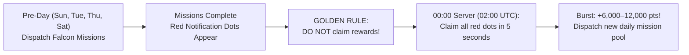
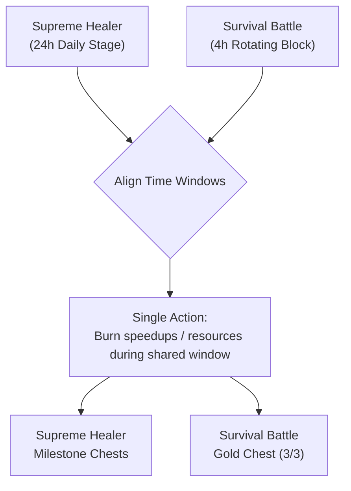

The **Supreme Healer (Top Healer)** event is the premier 7-day competitive tournament in Last Asylum: Plague. It tests your micromanagement, inventory planning, and resource patience. Unlike standard pay-to-win sprints, Supreme Healer is routinely won by strategic F2P and low-spender players who properly hoard Stamina, Falcon missions, Antitoxin, and carefully preserve and allocate speedups to matching days.

This guide provides the complete 7-day schedule, the exact day-by-day resource allocation matrix, advanced stacking mechanics, and how to double dip with Survival Battle for top-tier milestone chests.

> [!NOTE]
> The event unlocks at **Sanctuary level 6** and consists of **7 separate contests** run in sequence — each scores only its own actions. Actions are valued very unevenly, so what matters is the price of an action in the currently running contest. **Buying packs containing Diamonds gives 30 points per 1 Diamond in all seven contests** — the only action that always counts. **Launch:** on fresh servers the event starts on the **second Monday of the server's life** and runs 7 days (repeats weekly while the server is young).
>
> A second variant of this event replaces "Resource Acquisition" with **"Raven Enhancement"**: a Falcon quest is worth **1,350 points**, and spending **Raven Essence** gives **300 points**. Its reward thresholds go up to **180,000 points** (top threshold: 5 recruitment tickets).

---

## 🏆 Reward Thresholds {#rewards}

Rewards are granted for accumulated points. Most contests have five thresholds up to 10,000 points, with a universal UR hero fragment at the top:

| Points | Reward |
|---|---|
| **500** | Level Supplies: Grain (SR) ×2, Lumber (SR) ×2, Herb (SR) ×2 |
| **1,000** | Level Supplies: Grain (SR) ×2, Lumber (SR) ×2, Herb (SR) ×2 |
| **3,000** | Level Supplies: Grain (SR) ×6, Lumber (SR) ×6, Herb (SR) ×6 |
| **6,000** | Universal Hero Fragment (SSR) ×2, 60-min Speedup ×3, Recruitment Ticket ×2 |
| **10,000** | **Universal Hero Fragment (UR) ×1**, Antitoxin Supplies (SR) ×3, Recruitment Ticket ×2 |

## 🗓️ Complete 7-Day Scoring Schedule {#schedule}

Each day activates an exclusive scoring category. Pay special attention to what scores points—and what does NOT:

| Day | Daily Focus | Scoring Actions & Point Multipliers | Critical Rules & Pitfalls |
|---|---|---|---|
| **Day 1** | **Gathering & Stamina** | • 1 Stamina spent = **100 points** • 1 Falcon Mission completed = **1,000 points** • Gathering: 1 pt per 100 Wood/Food, 60 Herbs, or 40 Iron/Gold | ❌ Do NOT burn building or tech speedups. ✅ Dump stamina potions on mutants and bosses. ✅ Pre-gather: dispatch marches 4–6 hrs before 02:00 UTC. |
| **Day 2** | **Survivors & Building** | • Survivor Recruitment = **400 points each** • Construction Speedups = **20 points per 1 min** • Building Might = **1 point per +1 Might gained** | ❌ Falcon missions award 0 points today! ❌ Do NOT use research or troop speedups. |
| **Day 3** | **Technology & Research** | • 1 Falcon Mission completed = **1,000 points** • Research Speedups = **20 points per 1 min** • Research/Tech Might = **1 point per +1 Might gained** | ⚠️ **WARNING: NO POINTS FOR BUILDINGS ON DAY 3!** Building speedups and completed constructions grant 0 points! |
| **Day 4** | **Heroes & Healing** | • Hero Recruitment = **400 points per Ticket** • Skill Badges = **10 points per 1 Badge used** • **Hero star promotion** scores points • Antitoxin spent on **hero leveling** = **1 point per 660 units** | ❌ Falcon missions award 0 points today! ✅ Dump stockpiled serum into hero levels. ⚠️ **Weapon/gear upgrades do NOT count as hero upgrades** — craft gear any day, no need to wait for Thursday. |
| **Day 5** | **Total Force & Troops** | • Troops trained/promoted: T1=**5**, T2=**6**, T3=**7**, T4=**13**, T5=**15**, T6=**19**, T7=**22**, T8=**25**, T9=**28**, T10=**31** pts each • 1 Falcon Mission completed = **1,000 points** • All Speedups (Build, Tech, Troops) = **20 pts per 1 min** | ✅ Use the Promotion trick (T1 → T8/T9). ✅ Claim held "Frozen Hammer" buildings. |
| **Day 6** | **Elite Operations** | • UR Caravan completed = **5,000 points** • UR Secret Operation = **2,000 points** • Universal Speedups = **20 points per 1 min** • Healing Speedups = **20 points per 1 min** | ❌ Falcon missions award 0 points today! ✅ Reroll caravans & secret ops to gold (UR) tier. |
| **Day 7** | **Final Chaos (All Categories)** | • **TOTAL SHOWDOWN**: Every category from the week scores! • 1 Falcon Mission = **1,000 points** • 1 Stamina = **100 points** • Any Speedups = **20 points per 1 min** • Hero pulls, antitoxin, troops, gathering | 🔥 Prime day to dump Universal Speedups and push for Top 10 leaderboard rankings. |

> [!WARNING]
> **Critical Day 3 Trap (Technology & Research):** Many players mistakenly finish big building upgrades or burn construction speedups on Day 3. **Day 3 rewards ONLY Tech Research and Research Might!** Building timers and construction speedups give exactly **ZERO points**. Hold your building completions for Day 5 or Day 7.

---

## 📊 Day-by-Day Resource Allocation Matrix {#resource-allocation}

To consistently clear top milestone chests without unnecessary spending, follow this inventory schedule:

| Resource / Inventory Item | When to Spend (Scoring Days) | When to NEVER Spend | Tactical Notes |
|---|---|---|---|
| **Stamina (Potions / Energy Drinks)** | **Day 1** & **Day 7** | Days 2, 3, 4, 5, 6 | 1x 100-stamina potion = 10,000 immediate event points. |
| **Falcon Missions (Falcon Tower)** | **Days 1, 3, 5, 7** | **Days 2, 4, 6** | Claim strictly on odd days using the "Red Dot" technique. |
| **Antitoxin (Healing Serum)** | **Day 4** & **Day 7** | Days 1, 2, 3, 5, 6 | Stockpiled all week in workshop; dumped in Clinic on Day 4. |
| **Building Speedups** | **Day 2**, **Day 5**, **Day 7** | **Day 3 (0 points!)**, Days 1, 4, 6 | Match with 4-hour Survival Battle construction windows. |
| **Research Speedups** | **Day 3**, **Day 5**, **Day 7** | Days 1, 2, 4, 6 | Burn exclusively on high-tier technology branches. |
| **Training Speedups** | **Day 5** & **Day 7** | Days 1, 2, 3, 4, 6 | Use exclusively with the Promotion technique (T1 → T8/T9). |
| **Universal Speedups** | **Day 7** (Top priority) | Days 1, 2, 3, 4 | "Iron Reserve" for Day 7 leaderboard push or chest top-offs. |
| **Hero Recruitment Tickets** | **Day 4** & **Day 7** | Days 1, 2, 3, 5, 6 | Save in batches of 150–250+ tickets to sweep all chests. |
| **Hero Star Shards** | **Day 4** & **Day 7** | Days 1, 2, 3, 5, 6 | Hoard universal hero shards; promote stars on Thursday (Day 4) or Sunday (Day 7). Gear crafting is free anytime — it never scores hero points. |
| **Skill Badges** | **Day 4** & **Day 7** | Days 1, 2, 3, 5, 6 | Upgrade premier combat commander skills. |
| **Gold Caravans / Secret Ops** | **Day 6** & **Day 7** | Days 1–5 | Reroll using diamonds until you hit gold (UR) rank. |

---

## ⚡ Stamina Stacking & Pre-Gathering {#stamina-stacking}

Stamina is one of the most cost-effective F2P scoring engines on **Day 1** and **Day 7** (1 Stamina = 100 points):

1. **Pre-Gathering Marches the Night Before:**
   * 4–6 hours before daily reset (00:00 server / 02:00 UTC), dispatch all available troop marches to high-level resource nodes (Level 6–7 Herbs, Iron, Gold, Wood, Food).
   * Time their return so they finish gathering and arrive back inside your sanctuary right **after 02:00 UTC**, giving you an immediate points explosion on minute one of Day 1.
2. **Pre-Reset Natural Energy Cap:**
   * 10–12 hours before Day 1 begins, stop spending natural stamina on casual mutants.
   * Allow your energy bar to fill to maximum capacity (100–120/120) by server midnight (00:00 server / 02:00 UTC).
3. **Stockpiling Inventory Potions:**
   * Never consume inventory energy potions (10, 20, 50, 100 energy drinks) for casual zombie farming on off-days.
   * Buy energy potions consistently from the Alliance Shop and VIP Shop, and hoard daily quest rewards.
4. **Execution on Day 1 & Day 7:**
   * At server reset, unleash your full natural energy bar and inventory potions on **high-level mutants**, **Plague Lairs**, and **world bosses**.
   * Every 1,000 stamina consumed generates **100,000 event points**, guaranteeing that you clear the initial chest tiers in minutes.

---

## 🦅 Falcon Tower: Incident Storage, Navigation Compasses & the 29/30 Rule {#falcon-stacking}

In Supreme Healer, Falcon Missions score strictly on **Days 1, 3, 5, and 7** (**1,000 points** per mission). They provide 0 points on Days 2, 4, and 6!

> [!TIP]
> The complete visual storage guide by `#252 Dalkongss` is attached at the bottom of this page and available in the [Infographics Gallery](/infographics/#falcon-tower-storage).

### 1. Incident Storage Mechanics:
* Inside the **Falcon Tower**, access the mission screen and tap **Incident Storage**.
* When high-rarity (Purple/Epic or Gold/Legendary) missions appear, tap **Save**.
* **Saved missions never expire!** They remain banked indefinitely until scoring days (Days 1, 3, 5, and 7).

### 2. The 29/30 Rule (Why NOT 30/30?):
* The Incident Storage cap is exactly 30 missions.
* ❌ **If capped at 30/30:** the game considers your queue completely full and **freezes automatic mission generation** (1 free incident every 60 minutes). You lose passive free missions!
* ✅ **If held at 29/30:** the hourly background generation timer continues cycling normally every 60 minutes. Whenever an exceptional mission rolls, complete it or rotate it without forfeiting a single free incident.

### 3. Navigation Compass Preservation:
* **Navigation Compasses** force-refresh the quest board.
* Do not waste Compasses casually on Green or Blue incidents during off-days.
* Hoard your Compasses and burn them during active scoring days (1, 3, 5, 7) to cycle for high-rarity rewards and milestone points.

### 4. The "Red Dot" Hoarding Procedure Before Reset:
* **The Day Before a Scoring Stage** (Sunday before Day 1, Tuesday before Day 3, Thursday before Day 5, Saturday before Day 7):
  1. Dispatch heroes on all available Falcon quests.
  2. As missions complete, **red notification dots** appear over the Falcon Tower and mission log.
  3. **IRONCLAD RULE:** **DO NOT tap the rewards or clear the red dots before 02:00 UTC reset!** Leave all completed missions waiting in the log.
  4. Exactly at 00:00 server time (02:00 UTC), open the Falcon Tower and **claim every banked red dot in a single burst**: you instantly score **6,000 to 12,000+ free points** on minute one.
  5. Immediately dispatch and complete the fresh daily quest pool before the day ends for **double the daily point volume**!

---

## 🧪 Antitoxin Stacking (Healing Serum) {#antitoxin-stacking}

Antitoxin is a powerhouse scoring lever on **Day 4** (Heroes & Healing) and **Day 7** (Final Chaos):

* **Point Value:** 1 point per **660 units** of Antitoxin spent **leveling up your heroes** — the event scores hero XP/serum consumption, not healing infected residents.
* **Common Rookie Mistake:** Spending serum to level up heroes during Days 1–3 as it accumulates. That spending earns zero event points outside scoring days!
* **Stockpiling & Execution:**
  1. Keep your Antitoxin Workshop producing serum 24/7 (it has an internal production cap — collect in time).
  2. Bank serum all through the first part of the week and hold off on hero leveling.
  3. On **Day 4**, open the Clinic and level your hero squad in a single burst — synced with ticket summons (400 pts/ticket) and Skill Badges (10 pts/badge) for a stacked surge.

---

## ⏱️ Speedup Preservation: Strict Discipline & Specialization {#speedups-discipline}

Careless speedup usage is the primary reason players fall short of top milestone rewards. Adhere to strict specialization:

### 1. Construction Speedups
* **When to Burn:** Strictly on **Day 2** (Building), **Day 5** (Total Might), and **Day 7** (Final Chaos).
* **Absolute Prohibition:** **NEVER use on Day 3!** On Day 3, construction speedups award exactly **0 points**!
* **The "Frozen Hammer" Rule:** If a major building upgrade (Sanctuary, Lab) finishes ahead of schedule, do not tap the completed hammer icon. Wait until Day 2 or Day 5 to click and claim the Might gain.

### 2. Research Speedups
* **When to Burn:** On **Day 3** (Technology) and **Day 7** (Final Chaos).
* Tech provides compound value: 20 points per minute of speedup + 1 point per +1 point of Research Might gained.

### 3. Training Speedups & The Promotion Trick
* **When to Burn:** On **Day 5** (Troop Training) and **Day 7** (Final Chaos).
* **The Promotion Trick (T1 → T8/T9):**
  * Train cheap Tier 1 units during non-event days.
  * On Day 5, use the **Promotion** button to upgrade T1 units directly to your highest tier (T8/T9/T10).
  * Promoting requires **60% less time** than training from scratch while delivering significantly more points per minute of training speedup!

### 4. Healing Speedups & The Batch Healing Secret
* **How to Save Healing Speedups:**
  * **Never heal 20,000 wounded soldiers in a 24-hour batch.** Alliance helps only shave off tiny fractions.
  * **Batch Healing Technique:** Queue wounded troops in bite-sized batches of **15–20 minutes** each.
  * 15–20 alliance help taps from teammates clear each queue **instantly in 0 seconds with ZERO speedups consumed**.
  * *(Help capacity is capped by your **Alliance Hall** level, enabling up to 25–30 helps per queue at high levels).*
  * Repeating this loop lets you sweep all healing milestones for free while conserving 100% of your healing speedups for wartime, Day 4 and Day 7.

### 5. Universal Speedups
* Universal speedups are your high-leverage strategic reserve.
* **Never burn them early in the week!** Hold them for **Day 7 (Final Chaos)**, where they apply universally across all queues, or use them sparingly to close the final 200–500 points needed for Gold Chest #3 in Survival Battle.

---

## ⚔️ Double Dipping with Survival Battle {#double-dipping}

The premier tactic among top alliances is **Double Dipping**.

Operating concurrently with Supreme Healer around the clock is the [Survival Battle (Daily Survival)](/events/survival/) event. It rotates across **six 4-hour blocks** every day:
* **02:00 – 06:00 UTC**
* **06:00 – 10:00 UTC**
* **10:00 – 14:00 UTC**
* **14:00 – 18:00 UTC**
* **18:00 – 22:00 UTC**
* **22:00 – 02:00 UTC**

Each block contains 3 milestone chests. Clearing Gold Chest #3 awards substantial reserves of **Skill Badges**, Diamonds, and UR Hero Shards.

### How to Align Blocks for Maximum Rewards:
1. **Day 2 (Building):**
   * Wait for the 4-hour Survival Battle block featuring **"Territory Construction / Build Territory"**.
   * Burn construction speedups and click completed building hammers exclusively within this 4-hour window.
2. **Day 3 (Technology):**
   * Wait for the Survival Battle block featuring **"Research Tech"**.
   * Apply research speedups to score simultaneously in both events.
3. **Day 4 (Heroes):**
   * Open your hoarded recruitment tickets (150–250+) and Skill Badges strictly during the **"Enhance Heroes"** block.
4. **Day 5 (Troops):**
   * Execute mass unit Promotions during the **"Train Soldiers"** block.
   * ⚠️ **CRITICAL RULE:** In Survival Battle, troop training points are awarded **at the exact moment you tap the Train / Promote button** (when resources are deducted), NOT when the timer finishes! Never start troop queues before the designated 4-hour window starts.
5. **Day 7 (Final):**
   * Any active Survival Battle block provides dual-event progression since Day 7 scores every action.

### The Micro-Research Trick for Free Gold Chests:
* Keep 2–3 cheap, basic technologies (5–15 minute base research time) unresearched in your Lab.
* If you are 200–400 points short of Gold Chest #3 in a 4-hour Survival Battle block, start one of these quick techs and complete it with free alliance help clicks.
* **Net Result:** Clear the Gold Chest for free, preserve your speedups, and bank **up to 60,000 free Skill Badges** every week! For deep dives, check out the [Survival Battle Guide](/events/survival/) and [Alliance Duel Guide](/events/alliance-duel/).
