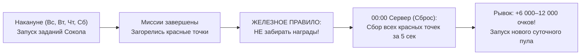
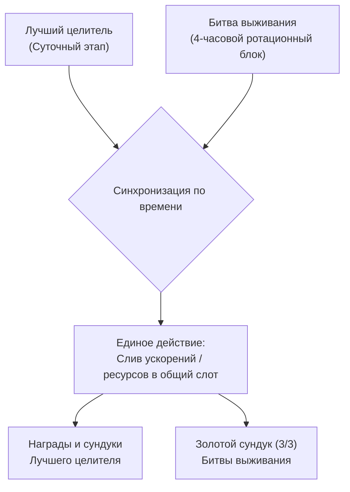

Событие **«Лучший целитель» (Supreme Healer / Top Healer)** — это главное недельное соревнование на сервере, проверяющее умение микроменеджмента, тайминга и долгосрочного накопления ресурсов. В отличие от стандартных ивентов, здесь побеждает не тот, кто больше донатит в моменте, а тот, кто методично сохранял выносливость, антитоксин, задания сокола, строительные таймеры и правильно распределял ускорения по дням.

Этот гайд содержит полную разбивку всех 7 дней, точную матрицу распределения ресурсов, разбор стакинга и синхронизацию с Битвой выживания для получения двойных наград.

---

## 🗓️ Полный 7-дневный график набора очков {#schedule}

Каждый день события открывает собственную зачётную категорию действий. Обратите особое внимание на правила начисления очков в каждый из дней:

| День | Фокус дня | Зачётные действия и коэффициенты очков | Запреты и нюансы |
|---|---|---|---|
| **День 1** | **Сбор и выносливость** | • 1 ед. потраченной выносливости = **100 очков** • 1 завершенное Задание сокола = **1 000 очков** • Сбор ресурсов: 1 очко за 100 ед. дерева/еды или за 60 ед. трав | ❌ Не жечь ускорения стройки и науки. ✅ Слив банок выносливости на зомби и боссов. |
| **День 2** | **Выжившие и стройка** | • Найм 1 выжившего = **400 очков** • Ускорение строительства: **20 очков за 1 минуту** • Прирост мощи от зданий: **1 очко за +1 к мощи** | ❌ Задания сокола не дают очков! ❌ Не тратить ускорения науки и казарм. |
| **День 3** | **Технологии и наука** | • 1 завершенное Задание сокола = **1 000 очков** • Ускорение исследований: **20 очков за 1 минуту** • Прирост мощи исследований/науки: **1 очко за +1 к мощи** | ⚠️ **ВНИМАНИЕ: В ДЕНЬ 3 НЕТ ОЧКОВ ЗА ЗДАНИЯ!** Строительные ускорения и молотки дают 0 очков! |
| **День 4** | **Герои и исцеление** | • Призыв героя: **400 очков за 1 билет найма** • Значки навыков: **10 очков за 1 значок** • Использование антитоксина (сыворотки): **1 очко за 660 ед.** | ❌ Задания сокола не дают очков! ✅ Слив накопленной сыворотки на лечение зараженных. |
| **День 5** | **Обучение войск и мощь** | • Тренировка и повышение ранга войск (очки зависят от тира: T7–T10) • 1 завершенное Задание сокола = **1 000 очков** • Любые ускорения (войска, стройка, наука): **20 очков за 1 минуту** | ✅ Метод Promotion (T1 → T8/T9). ✅ Реализация «замороженных молотков». |
| **День 6** | **Элитные операции** | • Золотой вагон (UR Caravan): **5 000 очков** • Секретная операция (UR Secret Op): **2 000 очков** • Универсальные ускорения: **20 очков за 1 минуту** | ❌ Задания сокола не дают очков! ✅ Реролл караванов и операций за алмазы до UR. |
| **День 7** | **Финальный хаос (Все категории)** | • **ТОТАЛЬНЫЙ СЧЁТ**: Засчитываются все механики недели! • 1 задание сокола = **1 000 очков** • 1 выносливость = **100 очков** • Любые ускорения: **20 очков за 1 минуту** • Антитоксин, призыв героев, сбор ресурсов, войска | 🔥 День максимальной отдачи универсальных ускорений и финального рывка в топ-10. |

> [!WARNING]
> **Критическая ловушка Дня 3 (Наука):** Многие игроки по ошибке завершают большие стройки или жгут строительные ускорения в День 3. **В День 3 очки даются ИСКЛЮЧИТЕЛЬНО за исследования технологий!** Здания и строительные таймеры дают ровно **ноль очков**. Приберегите завершение построек для Дня 5 или Дня 7.

---

## 📊 Матрица распределения ресурсов по дням недели {#resource-allocation}

Чтобы стабильно брать максимальные сундуки без лишних трат, используйте эту матрицу распределения инвентаря:

| Ресурс / Предмет в инвентаре | Когда тратить (Зачётные дни) | Когда категорически НЕ тратить | Тактическое примечание |
|---|---|---|---|
| **Выносливость (Банки / Энергетики)** | **День 1** и **День 7** | Дни 2, 3, 4, 5, 6 | 1 банка на 100 выносливости = 10 000 очков в событии. |
| **Задания Сокола (Falcon)** | **Дни 1, 3, 5, 7** | **Дни 2, 4, 6** | Сдача строго в нечётные дни методом «Красных точек». |
| **Антитоксин (Сыворотка)** | **День 4** и **День 7** | Дни 1, 2, 3, 5, 6 | Копится всю неделю в мастерской, тратится на лечение жителей. |
| **Строительные ускорения** | **День 2**, **День 5**, **День 7** | **День 3 (0 очков!)**, Дни 1, 4, 6 | Тратить синхронно с 4-часовым слотом Битвы выживания. |
| **Ускорения исследований** | **День 3**, **День 5**, **День 7** | Дни 1, 2, 4, 6 | Сливать только под крупные технологические ветки. |
| **Ускорения тренировки войск** | **День 5** и **День 7** | Дни 1, 2, 3, 4, 6 | Использовать исключительно с методом Promotion T1 → T8/T9. |
| **Универсальные ускорения** | **День 7** (приоритет) | Дни 1, 2, 3, 4 | «Золотой запас» для топ-10 или закрытия 3-го сундука выживания. |
| **Билеты найма героев** | **День 4** и **День 7** | Дни 1, 2, 3, 5, 6 | Копить пачками по 150–250+ штук для полного закрытия этапа. |
| **Значки навыков (Skill Badges)** | **День 4** и **День 7** | Дни 1, 2, 3, 5, 6 | Прокачивать ключевые боевые навыки командиров. |
| **Золотые вагоны / Операции** | **День 6** и **День 7** | Дни 1–5 | Рероллить караваны за алмазы до золотого (UR) качества. |

---

## ⚡ Стакинг выносливости (Stamina Stacking) {#stamina-stacking}

Выносливость — один из самых мощных F2P-инструментов набора очков в **День 1** и **День 7** (1 ед. = 100 очков):

1. **Подготовка естественной шкалы (Pre-Reset Cap):**
   * За 10–12 часов до наступления Дня 1 перестаньте расходовать выносливость.
   * К моменту сброса сервера (00:00 сервер / 02:00 UTC) шкала должна быть заполнена на максимум (100–120/120).
2. **Накопление банок из инвентаря:**
   * Не используйте инвентарные банки («Энергетические напитки» на 10, 20, 50, 100 ед.) на протяжении всей недели на случайных зомби.
   * Скупайте банки выносливости в Магазине альянса и VIP-магазине, забирайте награды за ежедневные квесты и события.
3. **Тактика слива в День 1 и День 7:**
   * С первых минут суток сливайте естественную полоску и пачки банок на **высокоуровневых мутантов**, **Логова чумы** и **мировых боссов**.
   * Каждые 1 000 потраченной выносливости приносят **100 000 очков**. Это гарантирует закрытие базовых сундуков первого дня за считанные минуты.

---

## 🦅 Задания Сокола: Дни 1, 3, 5, 7 и метод «Красных точек» {#falcon-stacking}

В событии «Лучший целитель» задания Сокола дают очки строго в **Дни 1, 3, 5 и 7** (по **1 000 очков** за каждую выполненную миссию). В Дни 2, 4 и 6 за них очков не начисляют!

### Пошаговый алгоритм накопления накануне:
* **В дни перед зачётными этапами** (в воскресенье перед Днем 1, во вторник перед Днем 3, в четверг перед Днем 5 и в субботу перед Днем 7):
  1. Запустите всех свободных героев на выполнение доступных заданий Сокола.
  2. Когда миссия завершится, над зданием Соколиной башни и в журнале загорится **красная точка** готовой награды.
  3. **ГЛАВНОЕ ПРАВИЛО:** **Ни в коем случае НЕ нажимайте на награду и НЕ сбрасывайте красные точки за день до зачётного дня!** Миссии никуда не пропадут и останутся ждать в журнале.
  4. **Правило очереди («Max - 1»):** Оставьте на доске хотя бы одну неначатую миссию, чтобы фоновый таймер генерации продолжал создавать новые задания.

### Действия в момент сброса (00:00 Server Time / 02:00 UTC):
1. Ровно при наступлении Дня 1, 3, 5 или 7 откройте журнал и **пачкой заберите все накопленные красные точки**.
2. Вы моментально получаете **от 6 000 до 12 000+ очков** на первой минуте нового дня.
3. Сразу после этого возьмите и выполните свежую ежедневную партию заданий и сдайте её до конца суток — это обеспечивает **двойной суточный объём очков** в каждый из зачётных дней.

---

## 🧪 Стакинг антитоксина (Сыворотка противоядия) {#antitoxin-stacking}

Антитоксин — секретный рычаг победы для вдумчивых игроков в **День 4** (Герои и исцеление) и **День 7** (Финал):

* **Формула очков:** 1 очко за каждые **660 ед.** использованного антитоксина при лечении жителей.
* **Ошибка большинства игроков:** Ежедневная трата сыворотки на каждого чихающего жителя в Дни 1, 2 и 3. В эти дни вы не получаете за лечение ни одного очка события!
* **Тактика накопления:**
  1. Держите Мастерскую противоядий в режиме непрерывного производства 24/7.
  2. Не лечите легкие стадии заражения в начале недели, позволяя резервуарам сыворотки заполниться до предела.
  3. В **День 4** открывайте Лазарет и проводите масштабный курс лечения инфицированных жителей пачками по сотням тысяч единиц сыворотки.
  4. Это приносит от **50 000 до 300 000+ очков** на чистом пассивном ресурсе без затрат алмазов и ускорений.

---

## ⏱️ Сохранение ускорений: строгая дисциплина и специализация {#speedups-discipline}

Хаотичный слив ускорений — главная причина, по которой F2P-игроки не могут закрыть финальные награды. Соблюдайте жесткое правило специализации:

### 1. Строительные ускорения (Building Speedups)
* **Когда тратить:** Строго в **День 2** (Стройка), **День 5** (Общая мощь) и **День 7** (Финал).
* **Категорический запрет:** **НИКОГДА не тратить в День 3!** В День 3 за строительство зданий и строительные ускорения начисляется ровно **0 очков**!
* **Совет «Замороженного молотка»:** Если апгрейд ключевого здания (Штаб, Лаборатория) готов за день до события, не нажимайте на иконку завершения. Дождитесь Дня 2 и завершите здание кликом — получите прирост мощи бесплатно.

### 2. Ускорения исследований (Research Speedups)
* **Когда тратить:** В **День 3** (Технологии) и **День 7** (Финал).
* Исследования дают двойной эффект: 20 очков за минуту ускорения + 1 очко за каждый пункт прироста технологической мощи.

### 3. Ускорения тренировки (Training Speedups) & Метод Promotion
* **Когда тратить:** В **День 5** (Обучение войск) и **День 7** (Финал).
* **Метод Promotion (T1 → T8/T9):**
  * В межсезонье штампуйте дешёвых солдат ранга T1 (пехоту/стрелков) с минимальным таймером.
  * В День 5 запустите повышение ранга (Promotion) этих T1 солдат до вашего максимального тира (T8, T9 или T10).
  * Апгрейд требует на **60% меньше времени**, чем обучение с нуля, а очков за минуту ускорения казармы даёт значительно больше!

### 4. Ускорения лечения (Healing Speedups) & Метод «Пакетного лечения»
* **Как сберечь ускорения лечения:**
  * **Не ставьте 20 000 раненых на 24 часа!** Каждый клик помощи альянса срежет ничтожные доли процента.
  * **Пакетный метод (Batch Healing):** Ставьте раненых небольшими порциями по **15–20 минут**.
  * 15–20 нажатий «Помощи альянса» от соклановцев закрывают пачку **мгновенно в 0 секунд БЕЗ траты ускорений**.
  * Повторяя этот цикл, вы сохраняете все лечебные ускорения на экстренные военные нужды и закрываете этапы исцеления бесплатно.

### 5. Универсальные ускорения (Universal Speedups)
* Универсальные ускорения — ваш главный стратегический резерв.
* **Не тратьте их в первой половине недели!** Приберегите их для **Дня 7 (Финальный хаос)**, где они принимаются для любых очередей, либо используйте точечно в минимальных объемах, чтобы добрать недостающие 200–500 очков до 3-го сундука в Битве выживания.

---

## ⚔️ Двойные награды с «Битвой выживания» (Double Dipping) {#double-dipping}

Главный тактический приём топ-альянсов — **Double Dipping (Двойная выгода)**. 

Ежедневное событие **«Битва выживания» (Daily Survival Battle)** работает параллельно с «Лучшим целителем» и разбито на **4-часовые ротационные блоки** с тремя сундуками наград на каждом этапе (включая золотой сундук со значками навыков, алмазами и UR-осколками).

### Как синхронизировать фазы для максимального профита:
1. **День 2 «Лучшего целителя» (Стройка):**
   * Дождитесь 4-часового блока Битвы выживания с задачей **«Строительство зданий / Мощь базы»**.
   * Запускайте строительные ускорения и завершайте здания только внутри этого окна.
2. **День 3 (Наука):**
   * Дождитесь блока Битвы выживания **«Технологии и исследования»**.
   * Сливайте исследовательские ускорения — вы одновременно закроете очки в обоих событиях.
3. **День 4 (Герои):**
   * Открывайте накопленные билеты призыва героев (150–250 шт.) строго в 4-часовой блок **«Развитие героев»**.
4. **День 5 (Войска):**
   * Проводите массовый Promotion войск в блок **«Обучение солдат»**.
5. **День 7 (Финал):**
   * Подходит абсолютно любой блок Битвы выживания.

### Трюк с «микро-исследованиями» для бесплатного 3-го сундука:
* Всегда держите в Лаборатории 2–3 начальные дешевые технологии с базовым временем изучения **5–15 минут** (например, первые уровни базовой защиты или сбора).
* Если в 4-часовом блоке Битвы выживания вам не хватает 200–400 очков до заветного 3-го золотого сундука, запустите одну такую микро-технологию и завершите её бесплатными кликами помощи альянса.
* **Итог:** Золотой сундук взят, ценные ускорения сохранены, а в копилку еженедельно падает **до 60 000 бесплатных значков навыков (Skill Badges)**!
